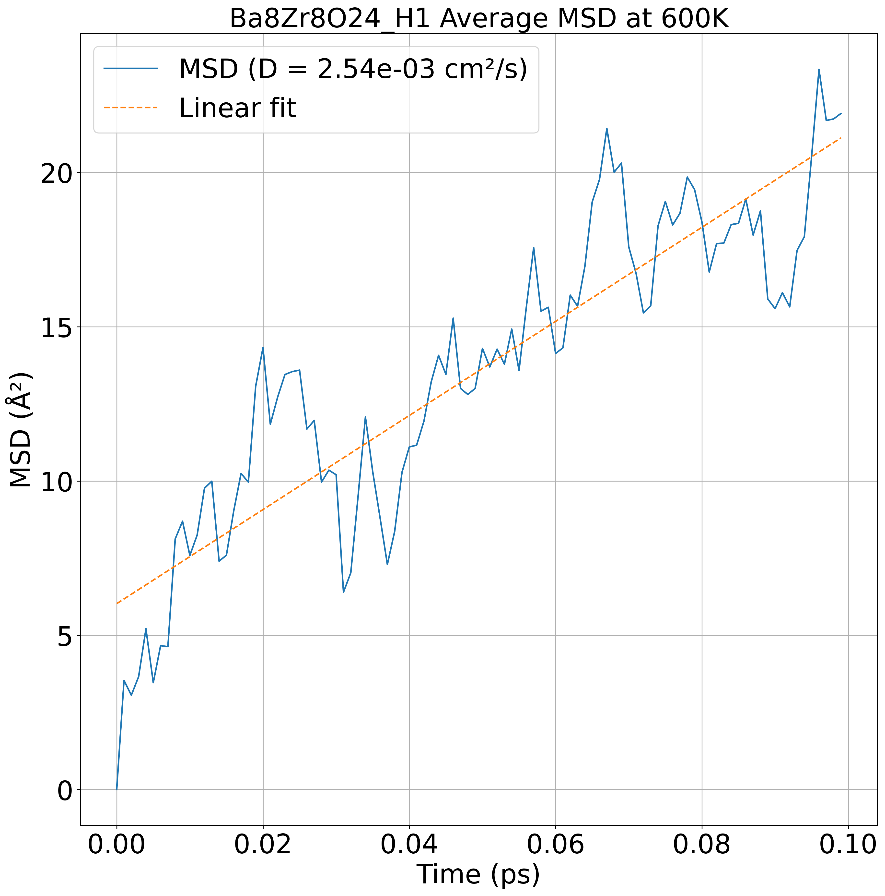

# Status as of 2024/12/3

* bandgap, convex hull: https://github.com/ishikawa-group/stability
* hydration, diffusion: https://github.com/ishikawa-group/kinetics

* Bandgap calculation: done
  + Bandgap for BaZrO3: 3.332 eV (Ref: 3.329 eV)

* Convex hull: done
  + Energy above hull per atom: 0.00 eV/atom (H2-rich, O2-rich,
    CO2-condition)(Ref: all 0.00 eV/atom)

* Hydration energy: done
  + Hydration energy = -0.067 eV (Ref: -0.073 eV)
  + Oxygen vacation formation energy = 6.715 eV (Ref: 6.757 eV)
  + Proton formation energy = 3.324 eV (Ref: 3.342 eV)

* Proton diffusion constant
  + M3GNet, pre-trained: done
  + M3GNet, fine-tuning: on-going
  + CHGNet, pre-trained: next
  + CHGNet, fine-tuning: next^2
  + LAMM(Fujitsu model): next^3
 

  

## Computational time benchmark
* Bandgap or convex hull: ~300 seconds (these two cases have almost
   same computational time)
* Hydration energies : 7743 seconds (geometry optimization of three
   structures)
* In the reference paper, the material screening is done for bandgap and convex hull, for ~5000 materials.
  According to the above computational time, this amounts to 300x5000/60/60 = 416.67 hours. --> parallel calculations